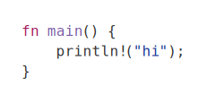

# Code Block Handling

`mdtolinkedin` supports four code-block handling modes via `--code-blocks <mode>` (or the legacy `--carbon` flag).

## Modes

### `omit`

Drops fenced code blocks from the output.

```bash
mdtolinkedin input.md --code-blocks omit
```


### `text`

Inlines the code block as plain text.

```bash
mdtolinkedin input.md --code-blocks text
```


### `carbon`

Replaces each code block with a Carbon URL.

```bash
mdtolinkedin input.md --code-blocks carbon
```


### `image`

Renders code blocks into SVG/PNG images and inserts their file paths in the output.

```bash
mdtolinkedin input.md --code-blocks image --code-image-dir code-images
```



## Image Tuning Options

- `--code-image-dir <DIR>`: Output directory (default: `code-images`)
- `--code-image-theme <NAME>`: Syntect theme name (default: `InspiredGitHub`)
- `--code-image-font <PATH>`: Optional font path (TTF/OTF)
- `--code-image-font-size <PX>`: Font size (default: `16`)
- `--code-image-bg <HEX>`: Background color (default: `#ffffff`)
- `--code-image-padding <PX>`: Padding (default: `24`)

If you pass an invalid theme or font path, the CLI reports an error during rendering.
